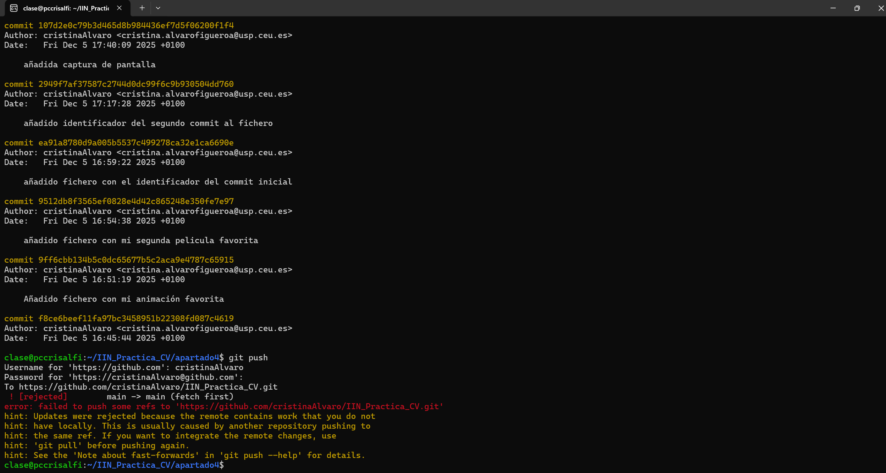

# IIN_Practica_CV
# Descripción del proyecto
El objetivo de este repositorio es hacer la práctica de git para poder aprobar la asignatura de informática, gracias Javier.
# Pruebas de Código
`
using System;

public class CalculadoraBasica
{
    public static void Main(string[] args)
    {
        // 1. Pedir el primer número
        Console.WriteLine("🤖 Calculadora Básica (Suma y Resta) 🤖");
        Console.WriteLine("--------------------------------------");
        Console.Write("Ingrese el primer número: ");
        
        // Intentar leer y convertir el primer número
        if (!double.TryParse(Console.ReadLine(), out double numero1))
        {
            Console.WriteLine("Error: Entrada inválida. Por favor, ingrese un número.");
            return;
        }

        // 2. Pedir el segundo número
        Console.Write("Ingrese el segundo número: ");
        
        // Intentar leer y convertir el segundo número
        if (!double.TryParse(Console.ReadLine(), out double numero2))
        {
            Console.WriteLine("Error: Entrada inválida. Por favor, ingrese un número.");
            return;
        }

        // 3. Pedir la operación
        Console.Write("Ingrese la operación (+ para sumar, - para restar): ");
        string operacion = Console.ReadLine();

        // 4. Realizar el cálculo
        double resultado = 0;
        bool operacionValida = true;

        switch (operacion)
        {
            case "+":
                resultado = numero1 + numero2;
                break;
            case "-":
                resultado = numero1 - numero2;
                break;
            default:
                Console.WriteLine("Error: Operación no válida. Solo se permite '+' o '-'.");
                operacionValida = false;
                break;
        }

        // 5. Mostrar el resultado (si la operación fue válida)
        if (operacionValida)
        {
            Console.WriteLine($"\n✅ El resultado de {numero1} {operacion} {numero2} es: {resultado}");
        }

        // Para mantener la consola abierta en algunos entornos
        Console.WriteLine("\nPresione cualquier tecla para salir...");
        Console.ReadKey();
    }
}
`

---

# Autor
Cristina Alvaro Figueroa
